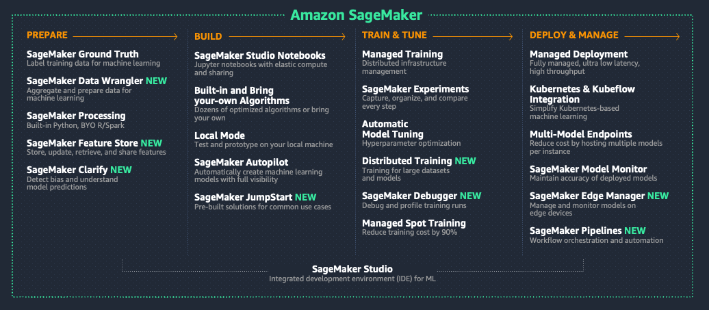
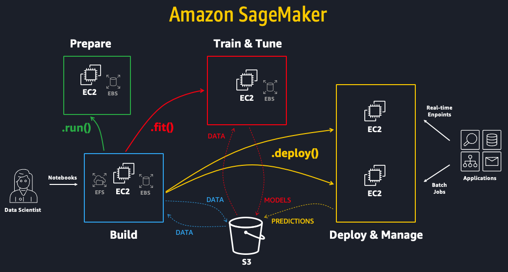
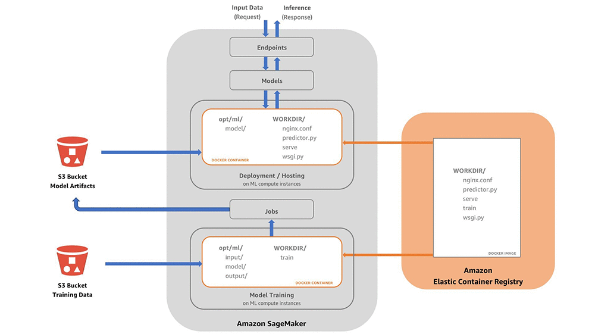
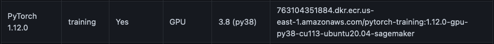
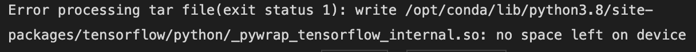

# Deep dive into the different steps of the project
Please find here the different steps of the develpment of the projects, the hardships encountered and the solutions found to overcome the isssues.
## Easy access to the other files
To know more about the work done for this project, please see the following files: 

- [**Overview_Internship.md**](../README.md): Overview and general information of the internship
    1. **Step1_DevelopmentProject.md - Current file**: Gives the details of the development of the project.
    2. [**Step2_ScaleProject.md**](./Step2_ScaleProject.md): Gives the details on how I intend to scale the project.
    3. [**TTS_Explanations.md**](./TTS_Explanations.md): Gives information on how Text-to-speech models work.

## Overview of the tasks accomplished 
- [x] Install the environment for the git repository on SageMaker
- [x] Use the pretrained models to synthetize text
- [x] Launch a training on a SageMaker jupyter's notebook
- [x] Create a custom docker image with the correct environment to run the code
- [ ] Sagemakerize the code to launch a training using pytorch estimators
- [ ] Train a model using a dataset of angry voices
- [ ] Develop a tool that would take as input a text, label the emotions present in the text and synthetize the voice using the algorithm corresponding to the emotion 

## Installation of the repository

The first step was to find an open source git repository that had implemented text to speech (TTS) models using deep learning. A very complete one is proposed by Mozilla at the following link: https://github.com/mozilla/TTS. There is repository that is more recent but less stable as changes are still made, it can be found at the following address: https://github.com/coqui-ai. I have decided to work with the first repository. The repository allows to use pre-trained algorithms but also to train your own model. 
Using SageMaker studio and a jupyter notebook, I cloned the repository and installed the requirements from the *requirements.txt* file. Depending on the image choosen for the notebook, several errors appear and it is necessary to install additional packages.
Here are some points to look at when troubleshooting: 
- Make sure you are using python3 and not python2, even in the terminal associated with the notebook
- use ```!pip freeze``` to see which libraries are already installed
- Check if pytorch is installed, if not you can switch the image used by your notebook or install pytorch. Make sure that the correct version is installed
``` 
import torch
print(torch.__version__)
#1.11.0+cu102
``` 
- Here is a list of the packages I had to install at some point but that did not appear to fully solve my problems, they could solve yours in another setting.
``` 
!apt-get update
!apt-get install python3-dev
!apt-get install gcc
!apt-get install --reinstall build-essential   
!conda install tensorflow-gpu cudatoolkit=10.1
!conda install pytorch torchvision -c pytorch
!pip install setuptools
``` 
The Jupyter Notebook is associated with an EC2 instance to run the code. The default one is the ml.t3.medium that has 2vCPU and 4GiB is not enough to train the model. Once the training is started, an error appears stating that there is no space left on the device. After testing several configurations, I have used the ml.m5.4xlarge instance to train models. 

## Use of the pretrained models 
The github repository has pretrained models that can be used to generate text. For that, it is necessary to choose a vocoder and a model. The jupyter notebook named [*startProjectGit.ipynb*](../scripts/1-UseOfPretrainedModels/startProject_Git.ipynb) shows the steps to use the repository on the Sagemaker studio. I have tested several configurations of the pretrained models and the vocoders and I noticed that the quality of the generated audio varies with the configurations. Hence, this adds a difficulty when training a model, the quality of the results might depend on the choice of the model but also on the choice of the vocoder. I have uploaded the audio files of two combinations: 
- The file [output_audio_hamlet_tacotron2_fullbandMelgan.wav](../outputs/output_audio_hamlet_tacotron2_fullbandMelgan.wav) is the result of the use of a tacotron2-DCA model trained using the ljspeech dataset and of the use of the fullband-melgan vocoder trained using the [libri-tts dataset](https://research.google/tools/datasets/libri-tts/). 
- The file [output_audio_hamlet_glowTTS_hifiganV2.wav](../outputs/output_audio_hamlet_glowTTS_hifiganV2.wav) is the result of the use of a glow-tts model trained using the [LJ speech dataset](https://keithito.com/LJ-Speech-Dataset/) and of the use of the hifigan_v2 vocoder trained using the [LJ speech dataset](https://keithito.com/LJ-Speech-Dataset/)  


## Training of a model using a standard dataset
Be careful, I have noticed that the required packages to install are different when training a model and when using trained models. My advice would be to have separate environments for the training and the generation of audio files. When training your own model you should not run this command : ```!pip install TTS ```.

Once the environment is setup using the indications previously given, I launched my own training. I decided to use a generic model, already built in the repository; the tacotron model using a well known dataset: the [LJ speech dataset](https://keithito.com/LJ-Speech-Dataset/). This is a public domain speech dataset. It contains 13,100 audio files of a unique speaker and each file has a transcription.

To launch the training of the model, it is first necessary to generate a configuration file. We need to specify:
-  the path of the generic configuration file
- the path of the training dataset
- the path of the output file being the trained model

This will result in the creation of the configuration file in the current directory. This file also contains the parameters needed for the training of the model, such as the number of epochs. After executing the python file *train_tacotron.py* with the configuration file as parameter, the training is launched. The code can be found in the [*trainModel_Git.ipynb*](../scripts/2-TrainingModelWithStandardDataset/trainModel_Git.ipynb) file.

The model is saved after each epoch, thus it is possible to follow the training. The model can be used to generate audio files. 

The git repository uses tensorboard to monitor the training. [Tensorboard](https://www.tensorflow.org/tensorboard/get_started) is a tensorflow tool that enables the tracking and visualization of metrics. In order to use tensorboard with SageMaker Studio it is necessary to use a [specific URL link](https://docs.aws.amazon.com/sagemaker/latest/dg/studio-tensorboard.html). Unfortunately, I was not able to visualize the metrics using tensorboard. As I wanted to use SageMaker managed tools and its built-in monitoring of the training, I did not analyze this problem further.

## Training of a model using SageMaker good practices

### General explanations of SageMaker

Amazon SageMaker is an AWS service that offers a wide range of tools for machine and deep learning tasks. The managed tools allow to prepare the data, build models, train and tune the models but also to deploy and manage the models. SageMaker Studio is an integrated develoment environment (IDE) that allows to use thoses managed tools.



To optimise resources and costs, there are recommended good practices with SageMaker Studio. The code should be separated into three parts, the preprocessing of the dataset, the training of the model and the inference. Each step should be done inside a container managed by Amazon SageMaker. Pytorch or scikit-learn estimators are managed and optimised objects in SageMaker with methods to perform the different steps. The data and the models are stored on Amazon S3 and each container can access S3. In order to follow the good practices, I tried to fit to this functionment.



As shown in the image below, the Docker images of the instances are stored on Amazon Elastic Container Registry. An image can be shared between several containers or each container, the preprocessing, training and deployment ones, can have their own Docker image. From now on, I will mainly focus on the training container. The train file can be inside the Docker image or it can be given to the instance as an entrypoint. It can be written in Python, R, Scale and Java. The training dataset must be stored in a S3 bucket on Amazon Simple Storage Service and at runtime the data is injected into the container. The model produced is then written inside the container, archived and pushed to Amazon S3. More details can be found in [AWS's documentation on SageMaker](https://aws.amazon.com/fr/blogs/machine-learning/train-and-host-scikit-learn-models-in-amazon-sagemaker-by-building-a-scikit-docker-container/)



### Following SageMaker good practices

Let's go back to the project. In order to simplify the process to "sagemakerize" the code, I did not separate the preprocessing from the training of the model. As the code is using Pytorch, I used a [pytorch estimator](https://sagemaker.readthedocs.io/en/stable/frameworks/pytorch/sagemaker.pytorch.html) from the SageMaker Python SDK which is called [boto3](https://boto3.amazonaws.com/v1/documentation/api/latest/index.html). Then I have loaded the dataset in Amazon S3. As it was already loaded in the file system of SageMaker studio, I used the following code to load it to S3 from the Jupyter Notebook.

Import the dataset into the storage service Amazon Simple Storage Service (S3):
``` 
import boto3
s3 = boto3.resource('s3')
!aws s3 cp LJSpeech-1.1 s3://<bucket-name>/TTS/LJSpeech-1.1 --recursive
``` 

The estimator takes as input an instance type in which the code will be executed and an entrypoint, which is the file we want to run. To use a pre-made container, it is necessary to also pass in the parameters a framework version and a python version. Else, to use a custom container it is necessary to pass its Elastic Container Registry link. The code can be found in the [*trainModelSM_Git.ipynb*](../scripts/3-TrainingModelSageMakerGoodPractices/trainModelSM_Git.ipynb) file. At first, I decided to use a pretrained container with: 
- A ml.m5.4xlarge instance 
- The default container with the "1.7.1" framework version and a python3 version. 
- The *train_tacotron.py* file as entry point.

#### First problems encountered 
By using the pytorch estimator, several problematics arose:
- how to install the requirements file on the instance ? 
- how to pass the configuration file as a parameter ?
- how to copy the TTS repository inside the instance so that the *train_tacotron.py* file could sucessfully run as it makes calls to other files?

#### Solutions
At first to debug, I have created a dummy python file, that would not need any other file to run and does not require imports that are not already installed in the docker image, as I was not able to install the requirements yet. The dummy file is under the name [*dummy_train.py*](../scripts/3-TrainingModelSageMakerGoodPractices/dummy_train.py). Thanks to this file, I was able to understand what was inside the container and if I had sucessfully loaded the TTS repository inside the container. I used the following commands: ``` print(os.getcwd(), os.system('ls'))```. 

The estimator has a "source_dir" parameter that takes the path to the python file *train_tacotron.py* or *dummy_train.py*. This parameter allows to solve two problems. First it copies all the files that are at the path into the EC2 instance. Secondly, it automatically installs the libraries if there is a *requirements.txt* file at the path.

Then in order to pass the configuration file as a parameter, I first thought about hardcoding the parameters inside the [*dummy_train.py*](../scripts/3-TrainingModelSageMakerGoodPractices/dummy_train.py). Instead, I managed to use the "hyperparameter" parameter of the Pytorch estimator that takes a dictionnary as input with the key being the name of the hyperparameter and the value is the path to the config file : ```hyperparameters = {'config_path' : "./config.json"}```. The 'config_path' parameter is passed to the *train_tacotron.py* file using parsers, as shown below:

``` 
# Parse the hyperparameters
parser.add_argument('--config_path', type=str, required=True)
args = parser.parse_args()
``` 

Finally , the code to use the pytorch estimator looks like that: 

``` 
pytorch_estimator = PyTorch(entry_point='dummy_train.py',
                            source_dir="./",
                            framework_version="1.7.1",
                            py_version="py3",
                            instance_type='ml.m5.4xlarge',
                            instance_count=1,
                            role = get_execution_role(),
                            hyperparameters = {'config_path' : config}
                           )
``` 

This allowed to load the TTS folder into the instance, the install the requirements and to give as input the config file.

#### Second problems encountered

However, another error occured, some of the requirements could not be met because some libraries were missing: "libsndfile1-dev" and "espeak-ng". These libraries need to be installed using "apt-get install" and not "pip", which is what is used with a requirement file. To solve this problem several ideas were tried: 
- Change the framework version and use the latest one: ```framework_version="1.11.0"```. 
    - However this did not solve the problem.
- Install the missing libraries directly inside the train file using ``` os.system("apt-get install libsndfile1-dev") ```. 
    - This solution was unsucessful because the requirement file is installed by the pytorch estimator before the execution of the [*dummy_train.py*](../scripts/3-TrainingModelSageMakerGoodPractices/dummy_train.py) file. Hence, the installation of some modules fails as there are missing dependencies. 
- Extend a container and add the missing installations. 
    - This is what I finally did. It is developed in the next section.


On a side note, each try to debug and understand how to use the pytorch estimator took several minutes as it had to launch an instance, run a lot of commands under the hood, install the requirements, etc... It made the debugging painful and un-optimal. Furthermore, it is complicated to navigate inside the instance to understand where the problems come from.  

## Training a model using SageMaker good practices and an extended container

As explained before, the default container used by the pytorch estimator lacks some modules, hence I need to extend a prebuilt container and use this container instead of the default one in the pytorch estimator.
First I followed the AWS tutorial to [extend a prebuilt container](https://docs.aws.amazon.com/sagemaker/latest/dg/prebuilt-containers-extend.html) using SageMaker Lab.

### Choose the container to extend 
There are several [containers available](https://github.com/aws/deep-learning-containers/blob/master/available_images.md). In order to use the container with a SageMaker Pytorch estimator, I need to take a container in the SageMaker Framework Containers (SM support only) section. I needed a PyTorch framework for training with the possibility to use a GPU, hence I have used the following container:



### Recreate the previous errors
In order to extend a container, I created a [*Dockerfile*](../scripts/4-TrainingModelSageMakerExtendedContainer/Dockerfile). To solve the problem encountered, I decided to first be able to recreate the problem of the missing libraries with the new container. Thus, I copied the *requirements.txt* file from the local repository to the container and I installed the requirements inside the container using the following commands:

``` 
COPY requirements.txt /opt/ml/code/requirements.txt
RUN pip install -r /opt/ml/code/requirements.txt
```
Once the [*Dockerfile*](../scripts/4-TrainingModelSageMakerExtendedContainer/Dockerfile) was created, I logged into the Elastic Container Registry that contains the container we have previously choosen and that we want to load to extend. Then, I ran the commands to build the docker image. The commands can be found in the [*creation_docker.ipynb*](../scripts/4-TrainingModelSageMakerExtendedContainer/creation_docker.ipynb) file.
``` 
!aws ecr get-login-password --region <region> | docker login --username AWS --password-stdin <aws_account_id>.dkr.ecr.<region>.amazonaws.com
!docker build -t extend_container_tts 
``` 

Unfortunately, when running the build commands an error occured:



I witnessed that the disk was full using the ```!df -h``` command. Then, I attempted to free some space by using the ``` !docker system prune``` command, or by removing old images using the following commands: 
```
!docker image ls
!docker image rm <image-id> -f 
```
As these attemps had failed, I tried to increase the size of the EBS volume attached. However, I did not manage to do that on SageMaker Lab. Hence, I decided to extend the container on an EC2 instance where I would be able to manually manage the size of the disk and other parameters. 

On a side note, when creating the [*Dockerfile*](../scripts/4-TrainingModelSageMakerExtendedContainer/Dockerfile), I thought about cloning mozilla's text to speech git repository into the Docker image. However I did no such thing for two reasons: 
- For a security reason: if a git repository happens to be private, it requires a key. If by mistake one forgets to remove the key from the docker image, there could be a leak of confidential data.
- For a durability reason: if there are minor code evolutions, the requirements would still be met, but if the code is in the docker image the container becomes outdated and useless.

 ### Extend the container using an EC2 instance

I first created an m6a.4xlarge EC2 instance with a standard EBS volume, added IAM permissions to access S3 and ECR using the AWS console. Then I installed docker using the following set of commands, which can be found in [*extendContainerEC2_hardcoded.sh*](../scripts/4-TrainingModelSageMakerExtendedContainer/extendContainerEC2_hardcoded.sh) and in [*extendContainerEC2_Parameters.sh*](../scripts/4-TrainingModelSageMakerExtendedContainer/extendContainerEC2_Parameters.sh):

```
Update the packages on your instance: [ec2-user ~]$ sudo yum update -y
Install Docker: [ec2-user ~]$ sudo yum install docker -y
Start the Docker Service: [ec2-user ~]$ sudo service docker start
Add the ec2-user to the docker group so you can execute Docker commands without using sudo: [ec2-user ~]$ sudo usermod -a -G docker ec2-user
```

Then, I copied my [*Dockerfile*](../scripts/4-TrainingModelSageMakerExtendedContainer/Dockerfile) and my *requirements.txt* files from S3 to my EC2 instance. I also added my ECR credentials and the command can be found in the ECR service on the AWS console. 
Without any surprise, when I ran the build command to generate my docker image, I had an error stating there was no space left on my device. 
At first, I tried repeating those steps on a very large EC2 instance: a m6a.48xlarge. The same problem happened. I decided to try to increase the size of the EBS volume attached. 

1. First I had to request an [EBS volume modification](https://docs.aws.amazon.com/AWSEC2/latest/UserGuide/requesting-ebs-volume-modifications.html). I have set the volume's size to 25GiB. 
2. Then it is necessary to [extend the volume](https://docs.aws.amazon.com/AWSEC2/latest/UserGuide/recognize-expanded-volume-linux.html) of the EC2 instance to the larger size. The commands are in the [*extendContainerEC2_hardcoded.sh*](../scripts/4-TrainingModelSageMakerExtendedContainer/extendContainerEC2_hardcoded.sh) file. Please see the [*extendContainerEC2_Parameters.sh*](../scripts/4-TrainingModelSageMakerExtendedContainer/extendContainerEC2_Parameters.sh) file to have a generic script. 

Prior to running this code, it is necessary to have a running m6a.4xlarge EC2 instance with a standard EBS volume. The EC2 instance should have IAM permissions for S3 and ECR. In addition, it is necessary to pass as parameters:
- The name of the bucket where you stored the zip file with the requirements.txt and Dockerfile files
- The name of the zip file
- The EBS volume ID of the instance 
- The region where the docker image will be stored
- The account ID

Of course these steps would not have been necessary if I had choosen the right size of EBS volume at the creation of the EC2 instance.

Once this problem was solved, I was able to reproduce the initial error of missing libraries. Thus I modified the [*Dockerfile*](../scripts/4-TrainingModelSageMakerExtendedContainer/Dockerfile) to include the installations commands : 

```
RUN pip install numpy --upgrade 
RUN apt-get -y update
RUN apt-get --yes install libsndfile1-dev
RUN apt-get --yes install espeak-ng
````

Once the image was created without an error, to save it, I [pushed it to Elastic Container Registry](https://docs.aws.amazon.com/AmazonECR/latest/userguide/docker-push-ecr-image.html) which is an AWS service. To do so, it is necessary to first login to ECR, tag the image we want to push and push it. Again, the full script is available in the [*extendContainerEC2_Parameters.sh*](../scripts/4-TrainingModelSageMakerExtendedContainer/extendContainerEC2_Parameters.sh) file.


Using the [*userDataEC2.sh*](../scripts/4-TrainingModelSageMakerExtendedContainer/userDataEC2.sh) and the [*userData_pythonScriptEC2.py*](../scripts/4-TrainingModelSageMakerExtendedContainer/userData_pythonScriptEC2.py) files I automated the setup for the EC2 instance. I managed to launch a training of the tacotron model by runing the *train_tacotron.py* file without using the pytorch estimator. Thus, I was able to state that my containerized environment was working.  

I have attempted to create an automatized script but did not manage to make it work yet. The final script would be [*CreationEnvironmentForTrainingAutomatized.sh*](../scripts/4-TrainingModelSageMakerExtendedContainer/CreationEnvironmentForTrainingAutomatized.sh) and would automate the process of the creation of the EC2 instance with the correct EBS volume's size, IAM permissions and the setup of the environment to launch a training in a EC2 instance. 

### Back to the initial problem: launch a training using a pytorch estimator

Now that the docker images is fully functional, I can launch the training of the model using the pytorch estimator. 
When the train method is called, it can take inputs from S3 as parameters. First, in an attempt to simplify the problem, I decided to keep the functionment of the git repository and copy the dataset directly into the instance, thus I would not need to pass the dataset as a parameter. The datastet is made of 13,103 files and has a total of 3.5GB. This is still reasonable to copy the files within the instance. To copy the dataset, the only option is to change the sctructure of the files and copy the dataset folder into the repository. The trees show the changes done.

Former file organisation
```bash
├── LJSpeechDataset
├── TTS
│   ├── folders & files
│   ...
│   ├── folders & files
│   ├── requirements.txt
│   ├── train_tacotron.py
│   ├── config.json
│   ├── trainModelSM_Git.ipynb
```

Below is the file organisation to allow the copy of the dataset inside the container. Please note that the path of the dataset had to be modified in the configuration file *config.json*. Please also note that I had to replace the content of the *requirements.txt* file by a a blank file. This is because the pytorch estimator automatically installs requirements which generates an error. I tried deleting the file, but an error was raised. The easiest patch was to create a blank *requirements.txt* file.

```bash
├── TTS
│   ├── LJSpeechDataset
│   ├── folders & files
│   ...
│   ├── folders & files
│   ├── requirements.txt
│   ├── train_tacotron.py
│   ├── config_updated.json
│   ├── trainModelSM_Git.ipynb
```

After adding the dataset into the container, I was able to run a training. However, I encountered additional troubles: I can't access the trained models that are currently saved into the instance. Because each change took a long time to test as the instance had to be initiated, the files copied etc... I had difficulties to solve those problems. Please note that to facilitate the process I was working with 100 sound files instead of the full dataset.

The upcoming troubles to solve imply making changes into the code of the git repository to adapt it to the pytorch estimator. I have digged into the code but did not manage to make the breakthrough to solve the issues, which are the following:
- [ ] Being able to pass the training data from Amazon S3 through the train method.
- [ ] Being able to recover the trained model.

