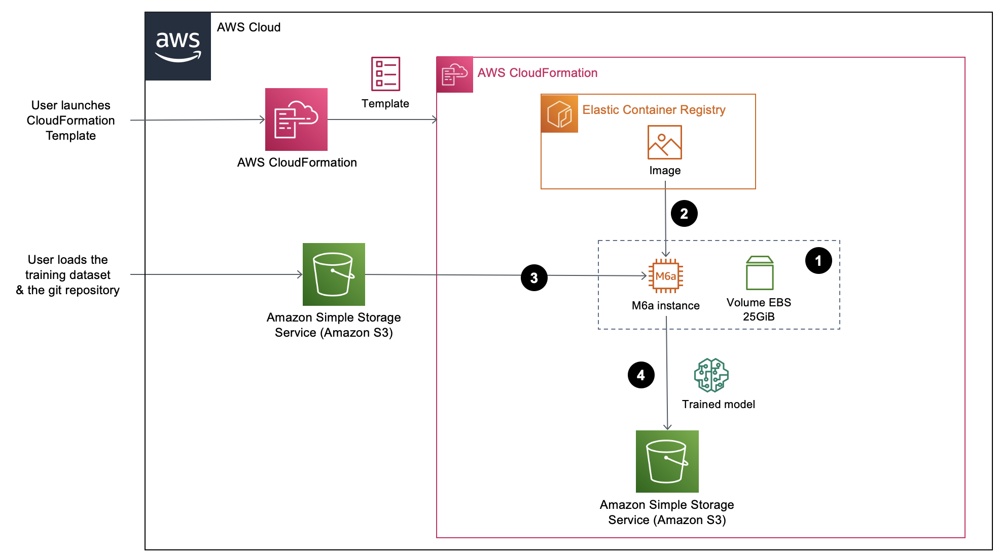

# Scaling of the project
Please find here the architectures used for the project and for the next steps. These architecture are meant to have a reproductible and scalable project.

## Easy access to the other files
To know more about the work done for this project, please see the following files: 

- [**Overview_Internship.md**](../README.md): Overview and general information of the internship
    1. [**Step1_DevelopmentProject.md**](./Step1_DevelopmentProject.md): Gives the details of the development of the project.
    2. **Step2_ScaleProject.md - Current file**: Gives the details on how I intend to scale the project.
    3. [**TTS_Explanations.md**](./TTS_Explanations.md): Gives information on how Text-to-speech models work.

## Architecture to train the model

Below is the architecture used to train models. In order to automate the commands, a CloudFormation template should be used. First, the user launches a CloudFormation template. Several steps are then executed/
1. A M6a instance is created with an EBS volume of 25GiB. 
2. Within the instance is launched a docker image stored in Elastic Container Registry. 
3. The training dataset and the git repository are loaded into the instance. Please note that these two elements must have been previously uploaded into Amazon S3 by the user. Both these elements can be changed and must be managed by the user.
4. The model is trained and stored in Amazon S3.

## Architecture to use the model and generate sound files

Let's consider that we have a trained model able to generate an angry voice. We want to take as input a text, do some sentiment analysis to determine the sentences that show anger and we want those sentences to be generated using our angry model and the rest of the text to be generated with a neutral voice. As a solutions architect in the making, I have thought about a serverless architecture using AWS services to solve this problematic. 

The input text goes through Amazon API Gateway and is given ti AWS Step Functions. The functions executed are the following:
1. A lambda function stores the text into Amazon S3 which allows to have a copy in case of problem
2. A second lambda function launches a job in Amazon Comprehend. The text is retrived from S3 and given to Comprehend to perfom some sentiment analysis. Tags of emotion are added to the text. The tagged text is then stored in S3.
3. A third lambda function retrieves the models and the text with tags of emotions from S3, generates the audio file and stores it in S3.

It is possible that Amazon Comprehend has difficulties to tag the text properly. A sentence with no "angry" word could still have anger. For example, we could want to pronounce the sentence "I am hungry" with anger but Amazon Comprehend would not necessarly notice any anger in the choice of words and thus would not add an "angry" tag. In this case, we could want to add a text that already have the tags of emotions. The corresponding architecture would be the following.

