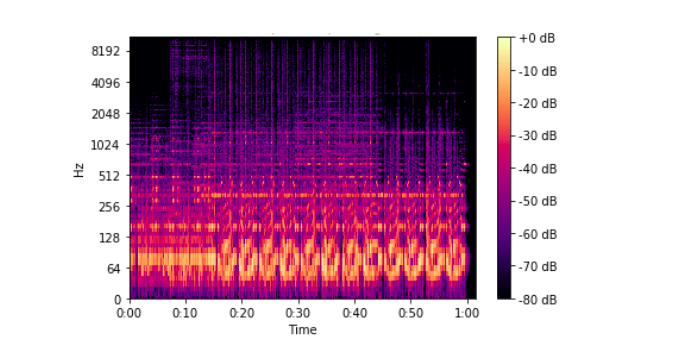

# Text-to-speech models
Please find here further explanations on how text-to-speech models work.

## Easy access to the other files
To know more about the work done for this project, please see the following files: 

- [**Overview_Internship.md**](../README.md): Overview and general information of the internship
    1. [**Step1_DevelopmentProject.md**](./Step1_DevelopmentProject.md): Gives the details of the development of the project.
    2. [**Step2_ScaleProject.md**](./Step2_ScaleProject.md): Gives the details on how I intend to scale the project.
    3. **TTS_Explanations.md - Current file**: Gives information on how Text-to-speech models work.

## How do TTS models work? 

Text-to-speech (TTS) models are used to generate an audio from a text. It is meant to generate human-like voices. The scheme below is a high level diagram of the components used in the TTS:

Let's deep dive into the model. The preprocessor takes as input a text and outputs linguistic features which are made of phonemes. A [phoneme](https://www.britannica.com/topic/phoneme) is the smallest unit of speech distinguishing one word from another. For example the "p" is a phoneme in the words "tap", "tab", "tag" and "tan". During the preprocessing, there is first a tokenization step which transforms a sentence into base words. Then the tokens are converted into phonemes based on their pronunciation. 

Then the linguistic features are given to the Encoder, which outputs latent features which is a n-dimensional embedding.

Then the decoder takes as input the latent features and ouptuts an acoustic feature, which is a Mel-spectogram. To understand what is a Mel-spectogram, let's see what is a spectogram first. A [spectogram](https://towardsdatascience.com/all-you-need-to-know-to-start-speech-processing-with-deep-learning-102c916edf62) represents the time on the x-axis and the frequency on the y-axis. The amplitude of the sound in deciBel in given for each (x,y) using a colormap. Below is the example of the spectrogram of an audio file.

A [Mel Scale](https://towardsdatascience.com/all-you-need-to-know-to-start-speech-processing-with-deep-learning-102c916edf62) is the result of a non-linear transformation of the frequency scale that represents the perception of the human ear of sounds. The human ear can perceive differences of sounds in some range of frequencies but cannot in other ranges. The Mel Spectogram is a spectogram with this non-linear transformation of the frequency on the y-axis.

Once the Mel-spectogram is generated, the acoustic feature is given as input to the vocoder that produces a waveform. There are two ways to do so:
- First by using a mathematical model (eg: Griffin Lim method)
- Or by training a neural network to learn the correspondane between the mel-spectogram and the waveforms.

Usually the results are better using the mathematical models.

## Bibliographie

https://arxiv.org/pdf/1703.10135v2.pdf

https://paperswithcode.com/task/text-to-speech-synthesis

https://towardsdatascience.com/all-you-need-to-know-to-start-speech-processing-with-deep-learning-102c916edf62

https://towardsdatascience.com/text-to-speech-explained-from-basic-498119aa38b5

https://static.googleusercontent.com/media/research.google.com/fr//pubs/archive/45882.pdf

In progress...
